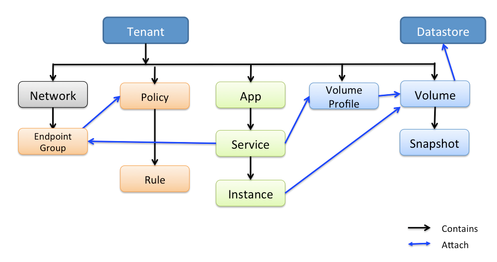

[](https://godoc.org/github.com/contiv/contivmodel/client)

# Contiv Object Model
This is how current object model looks like:



### Using go client
Here is an example of how to use contiv go client

```
package main

import (
    "log"

    "github.com/contiv/contivModel/client"
)

func main() {
    cl, err := client.NewContivClient("localhost:9999")
    if err != nil {
        log.Fatal(err)
    }
    
    // Define a policy
    policy := client.Policy{
        TenantName: "tenant1",
        PolicyName: "policy",
    }
    
    // Create policy
    err = cl.PostPolicy(policy)
    if err != nil {
        log.Errorf("Policy Creation failed. Err: %v", err)
    }
}
```
