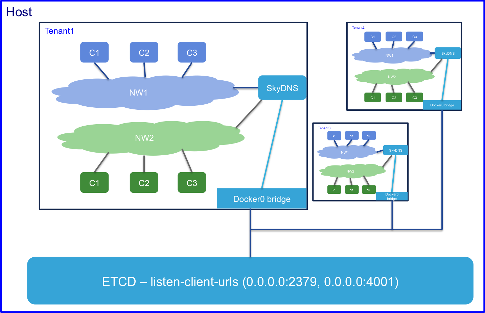

<h1>Service Binding with Netplugin</h1>

Services are automatically made discoverable by netplugin via a DNS provider when they are brought up. SkyDNS is the preferred and default DNS provider(currently) when using netplugin.

The diagram below is a representation of the Service binding architecture offered by netplugin:


Service binding states are modified during the following triggers:

1. DNS entry is automatically created when the container is brought up
2. DNS entry is removed in the following conditions:
  - when the container is stopped/removed
  - when the host on which the container resides crashes

<h4> Trying out service binding features </h4>
Refer to [README.md](../README.md) to setup and bringup netplugin environment

Run `make demo`

The example here shows how services are discoverable within a tenant.

<h4>Creating a new tenant</h4>
When netplugin is started, it creates a default tenant. You can check out service binding/discovery with just the default tenant. However, if you are interested in testing out how services are available within a tenant but isolated from other tenants, you can create a tenant using the following command:

`netctl tenant create --subnet-pool 100.1.0.0/16 --vlans 2000-2100 --vxlans 12000-12100 tenant1`

After the tenant creation, a DNS container is automatically created for service any DNS queries within the tenant
```
vagrant@netplugin-node1:~$ docker ps
CONTAINER ID        IMAGE                          COMMAND             CREATED             STATUS              PORTS               NAMES
dc70915bc835        skynetservices/skydns:latest   "/skydns"           2 minutes ago       Up 2 minutes        53/udp, 53/tcp      tenant1dns
213a588919b5        skynetservices/skydns:latest   "/skydns"           4 minutes ago       Up 4 minutes        53/tcp, 53/udp      defaultdns
```

<h4> Create a new network and endpoint to launch containers </h4>
- Network creation
  - `netctl net create --tenant tenant1 --pkt-tag 12000 -s 100.1.2.0/24 --gateway 100.1.2.254 webnw`

- Endpoint creation
  - `netctl group create --tenant tenant1 webnw web`

<h4> Launch containers </h4>
Launch services providing the DNS address in the --dns argument. You can find the DNS IP by inspecting the DNS container. It is generally the first IP address in the subnet provided for the network. Verify it by issuing the following command:

```
vagrant@netplugin-node1:~$ docker exec -it tenant1dns ifconfig
....

eth1      Link encap:Ethernet  HWaddr 02:02:64:01:02:01
          inet addr: 100.1.2.1  Bcast:0.0.0.0  Mask:255.255.255.0
          inet6 addr: fe80::2:14ff:fe01:101/64 Scope:Link
          UP BROADCAST RUNNING MULTICAST  MTU:1450  Metric:1
          RX packets:8 errors:0 dropped:0 overruns:0 frame:0
          TX packets:8 errors:0 dropped:0 overruns:0 carrier:0
          collisions:0 txqueuelen:0
          RX bytes:648 (648.0 B)  TX bytes:648 (648.0 B)
```

<h4>Launch services in the network</h4>
```
docker run -itd --net=web.webnw.tenant1 --dns=100.1.2.1 --dns-search=tenant1 --dns-search=webnw.tenant1 --name=web1 --hostname=web4 ubuntu /bin/bash
docker run -itd --net=web.webnw.tenant1 --dns=100.1.2.1 --dns-search=tenant1 --dns-search=webnw.tenant1 --name=web2 --hostname=web4 ubuntu /bin/bash
docker run -itd --net=web.webnw.tenant1 --dns=100.1.2.1 --dns-search=tenant1 --dns-search=webnw.tenant1 --name=web3 --hostname=web4 ubuntu /bin/bash
```
<h4>Verifying services using DNS</h4>
Install tools like nslookup/dig to verify that all services are listed
```
root@web1:/# dig web.webnw.tenant1 SRV

; <<>> DiG 9.9.5-3ubuntu0.5-Ubuntu <<>> web.webnw.tenant1 SRV
;; global options: +cmd
;; Got answer:
;; ->>HEADER<<- opcode: QUERY, status: NOERROR, id: 47572
;; flags: qr aa rd ra; QUERY: 1, ANSWER: 3, AUTHORITY: 0, ADDITIONAL: 3

;; QUESTION SECTION:
;web.webnw.tenant1.             IN      SRV

;; ANSWER SECTION:
web.webnw.tenant1.      11      IN      SRV     10 33 0 beb9e72d6f67.web.webnw.tenant1.
web.webnw.tenant1.      11      IN      SRV     10 33 0 7a3bec808f74.web.webnw.tenant1.
web.webnw.tenant1.      11      IN      SRV     10 33 0 44ad507b6786.web.webnw.tenant1.

;; ADDITIONAL SECTION:
beb9e72d6f67.web.webnw.tenant1. 11 IN   A       100.1.2.2
7a3bec808f74.web.webnw.tenant1. 11 IN   A       100.1.2.3
44ad507b6786.web.webnw.tenant1. 11 IN   A       100.1.2.4

;; Query time: 9 msec
;; SERVER: 20.1.1.1#53(20.1.1.1)
;; WHEN: Tue Dec 01 00:30:19 UTC 2015
;; MSG SIZE  rcvd: 272
```

Ping using service name to verify that the hostname is resolved correctly.
```
root@web1:/# ping web
PING web.webnw.tenant1 (20.1.1.5) 56(84) bytes of data.
64 bytes from web3 (20.1.1.5): icmp_seq=1 ttl=64 time=0.291 ms
64 bytes from web3 (20.1.1.5): icmp_seq=2 ttl=64 time=0.030 ms
64 bytes from web3 (20.1.1.5): icmp_seq=3 ttl=64 time=0.255 ms
64 bytes from web3 (20.1.1.5): icmp_seq=4 ttl=64 time=0.053 ms
```

<h4> Explore your way through </h4>
Here are some more scenarios to explore for services
- Launch multiple networks in a tenant1 and all the services across these networks in the tenant are still discoverable
- Launch multiple tenants and note that services in one tenant are not visible to other tenants thus providing isolation
- Stop/Kill a service container and the DNS entries are updated to reflect this
- If the host on which the service is residing is killed, all the service entries on the host expire after the TTL expires

