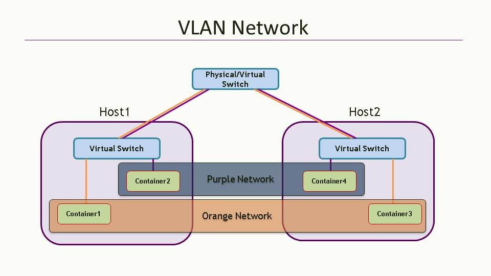
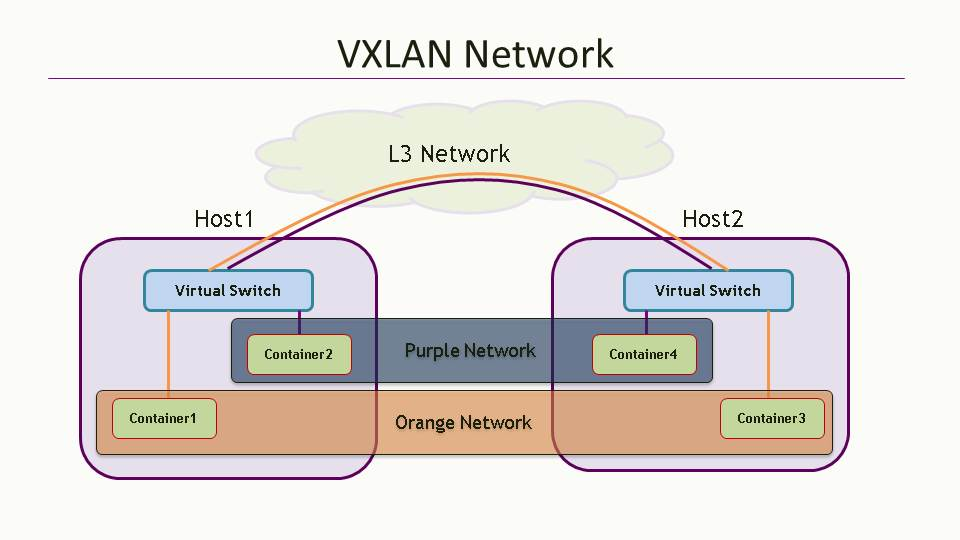

In this example we will simulate a two host cluster (with the two hosts being simulated by two vagrant vms) and deploy a multi vlan configuration on them. The logical topology looks similar to one shown below:



1. Launch the two node setup:

    ```
    cd $GOPATH/src/github.com/contiv/netplugin
    CONTIV_NODES=2 make build demo
    ```
    
    Note: User may simulate more hosts by setting the CONTIV_NODES variable to a desired number. Each host corresponds to a vagrant-vm, which are connected through their 'eth2' interface to a virtualbox bridge network for the container data traffic.

2. Once the make is done, start a separate ssh session to each node and run the netplugin:

    ```
    CONTIV_NODES=2 vagrant ssh netplugin-node1
    sudo $GOPATH/bin/netmaster &
    sudo $GOPATH/bin/netplugin -host-label host1 &
    ```
    ```
    CONTIV_NODES=2 vagrant ssh netplugin-node2
    sudo $GOPATH/bin/netplugin -host-label host2 &
    ```

3. Load the multi-host multi vlan configuration from the [../examples/two_hosts_multiple_vlans_nets.json](../examples/two_hosts_multiple_vlans_nets.json) file by issuing the following commands from one of the vagrant vms.

    ```
    CONTIV_NODES=2 vagrant ssh netplugin-node1
    cd $GOPATH/src/github.com/contiv/netplugin
    netdcli -cfg examples/two_hosts_multiple_vlans_nets.json
    ```

4. Launch 4 containers, two on each vagrant node that we will add to the two networks viz. orange and purple later.

    On netplugin-node1:
    ```
    sudo docker run -itd --name=myContainer1 --hostname=myContainer1 ubuntu /bin/bash
    sudo docker run -itd --name=myContainer2 --hostname=myContainer2 ubuntu /bin/bash
    ```
    On netplugin-node2:
    ```
    sudo docker run -itd --name=myContainer3 --hostname=myContainer3 ubuntu /bin/bash
    sudo docker run -itd --name=myContainer4 --hostname=myContainer4 ubuntu /bin/bash
    ```

5. Now everything should be setup as per the diagram and we are good to test the connectivity.

    On netplugin-node1:
    ```
    # ping from myContainer1 to myContainer3 should succeed (both belonging to orange network)
    $ docker exec -it myContainer1 /bin/bash
    < inside the container >
    $ ip addr
    $ ping 11.1.0.2

    # ping from myContainer2 to myContainer4 should also succeed (both belonging to purple network)
    $ docker exec -it myContainer4 /bin/bash
    < inside the container >
    $ ip addr
    $ ping 11.1.1.2

    # ping between containers belonging to different networks would fail
    # unless they belong to the same tenant and routing is enabled.
    ```

Trying out VXLAN network is similar, except using [examples/two_hosts_multiple_vxlan_nets.json](examples/two_hosts_multiple_vxlan_nets.json)
configuration file instead, and it emulates the connectivity as in the following diagram:


