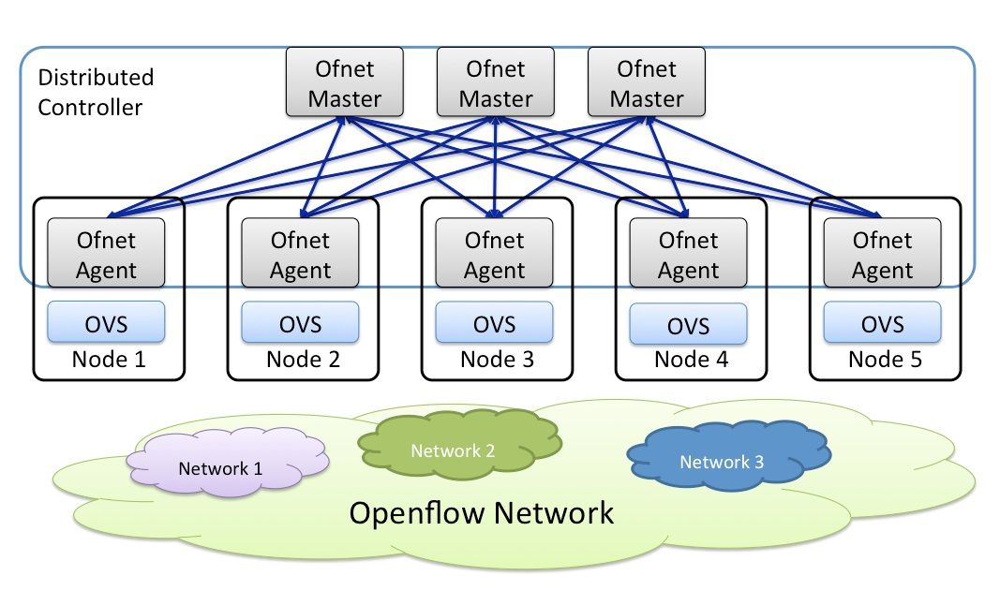
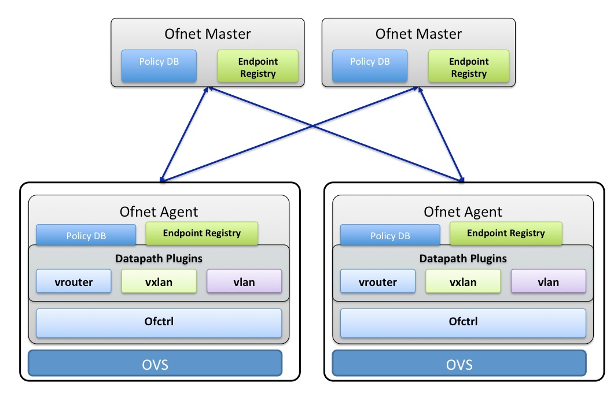

# Ofnet
Ofnet is a networking library that manages a network of openflow switches using a distributed controller architecture

Ofnet is a golang library that can be used by Container network drivers or container executors to manage a cluster wide network. Ofnet implements openflow 1.3 based controller and works with OpenVswitch. Ofnet manages only the openflow forwarding aspect of OVS. It does not create OVS interfaces/ports required by containers. It is assumed that container network driver creates OVS interface, moves it to container namespace and passes endpoint information to Ofnet library using its API.

Ofnet Controller supports multiple Software Defined Networking paradigms. They are

  1. **vrouter**
    - In this mode entire network operates like a giant router. IP packates are forwarded based on their IP dest address using a Vxlan overlay. Ofnet controller keeps track of all IP addresses in the network and programs OVS to lookup IP destination address and forward it using the overlay. It Proxies all ARP requests so that there is no need for broadcast in the network.
  2. **vxlan bridge**
    - In this mode each OVS acts as a VXLAN switch and together they emulate multiple bridge domains. This mode requires OVS 2.3.1 or higher.
  3. **vlan bridge**
    - In this mode OVS acts as a VLAN bridge
  4. **vlan router**
    - In this mode OVS acts as an IP Router. Control plane protocol like BGP is used to exchange routing information with physical switches

# High level Architecture

As shown above Ofnet Controller consists of Ofnet Agents that run on each host along with OVS and multiple Ofnet Masters. Ofnet agents can connect to any number of Ofnet Masters. Ofnet Masters largely act as state distributors. Ofnet Masters and Agents form an eventually consistent database that can survive multiple node failures, network partitioning and temporary hiccups. Controller state is guaranteed to eventually reach a consistent state.

Ofnet controller supports the concept of multiple networks. Depending on the forwarding paradign, this can be mapped to Tenats(VRF in networking lingo, VPC in cloud lingo), Subnets or bridge domains.

# Multiple datapath plugins

Ofnet Controller supports multiple data path plugins. Currently vrouter and vxlan plugins are implemented. Vlan plugin is in development. These plugins use Ofctrl library to program Flows in OVS. Please see Ofctrl subdirectory on more details.

# Usage
